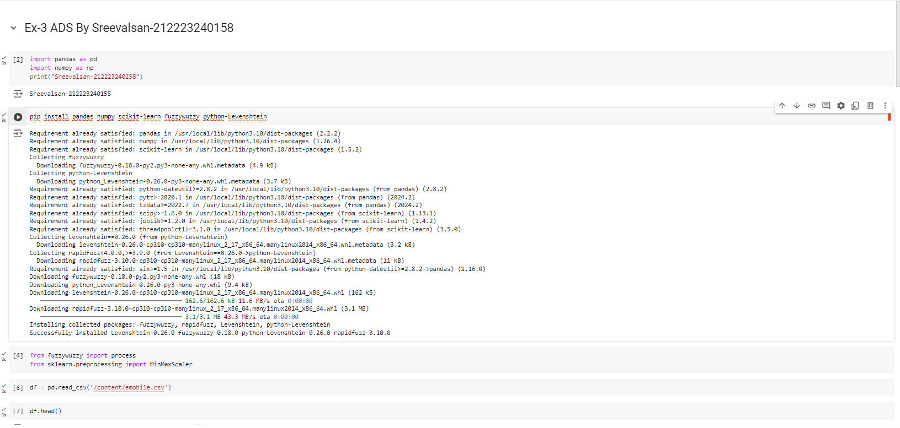
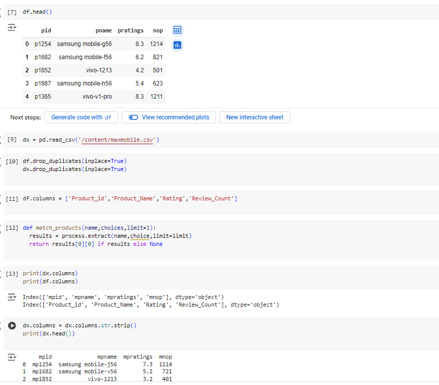
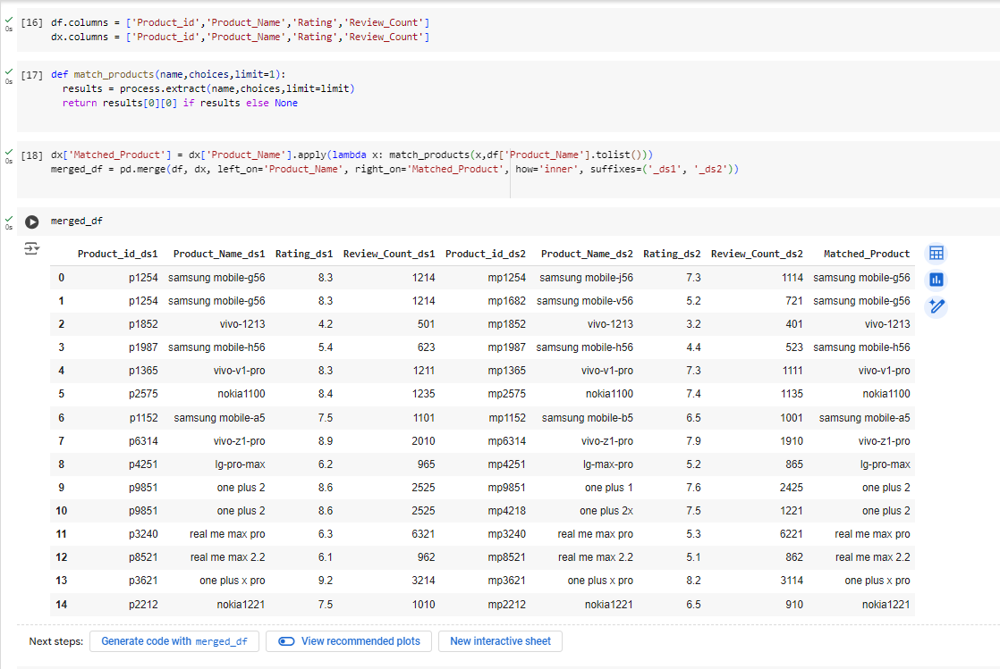
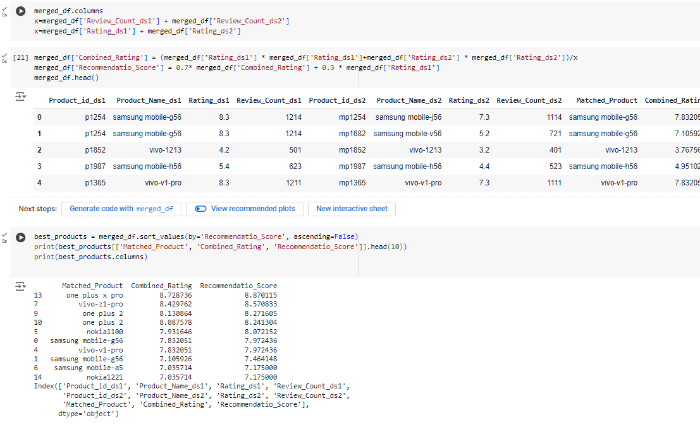
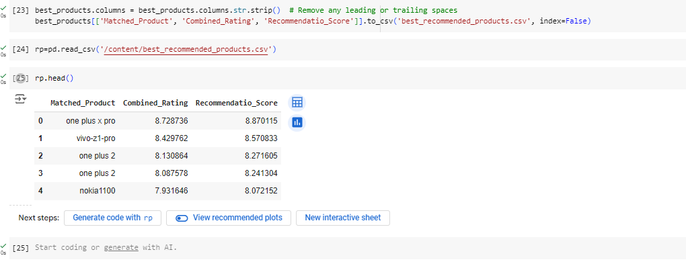

# EX03-Recommendation-System
## NAME: SREEVALSAN
## REGISTER NO: 212223240158
## AIM:
To Implement Recommendation Systems using the suitable data sets.

## ALGORITHM:
STEP 1: Load the necessary Datasets.

STEP 2: Include the necessary python library.

STEP 3: Use Fuzzy library for handling text data.

STEP 4: Perform Data Preprocessing Steps.

STEP 5: Standardize column names for merging.

STEP 6: Apply fuzzy matching to find similar text data between datasets.

STEP 7: Perform Data transformation between datasets.

STEP 8: Define a recommendation score using the features of the datasets.

STEP 9: Sort the data by recommendation score.

STEP 10: Export the results to a CSV file.

## CODING AND OUTPUT:

## RESULT:
Thus, Recommendation Systems using the suitable data sets is implemented successfully.

